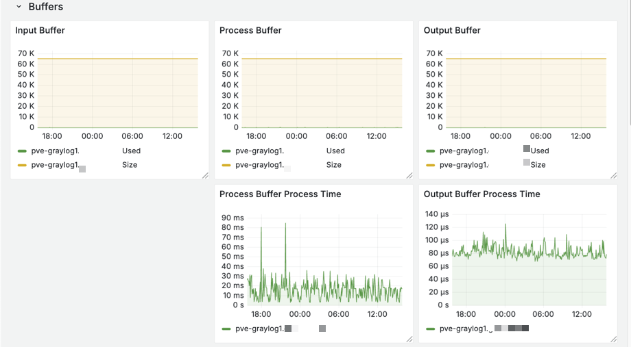
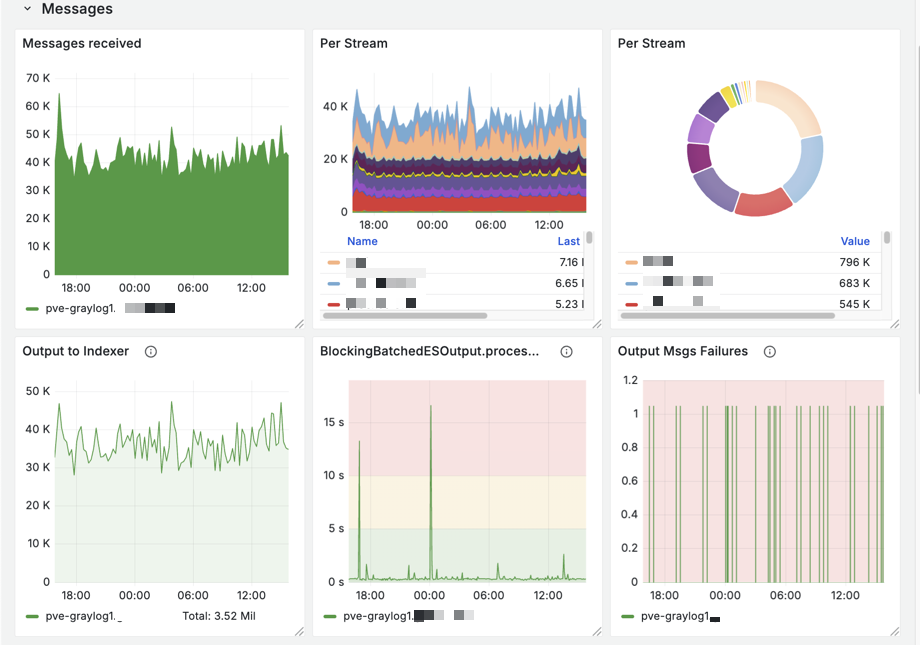
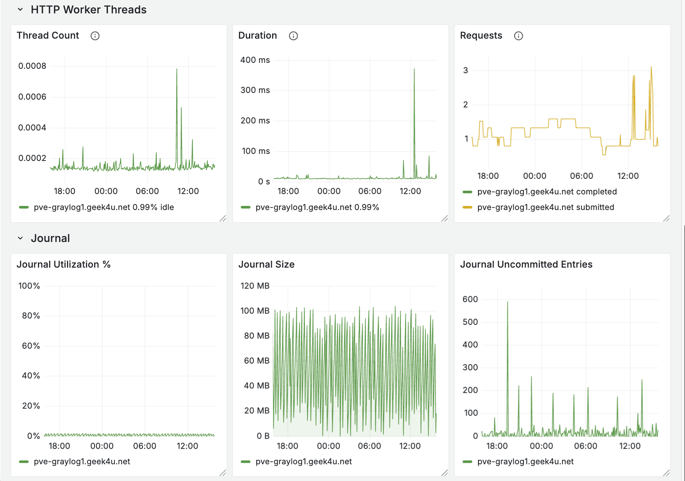
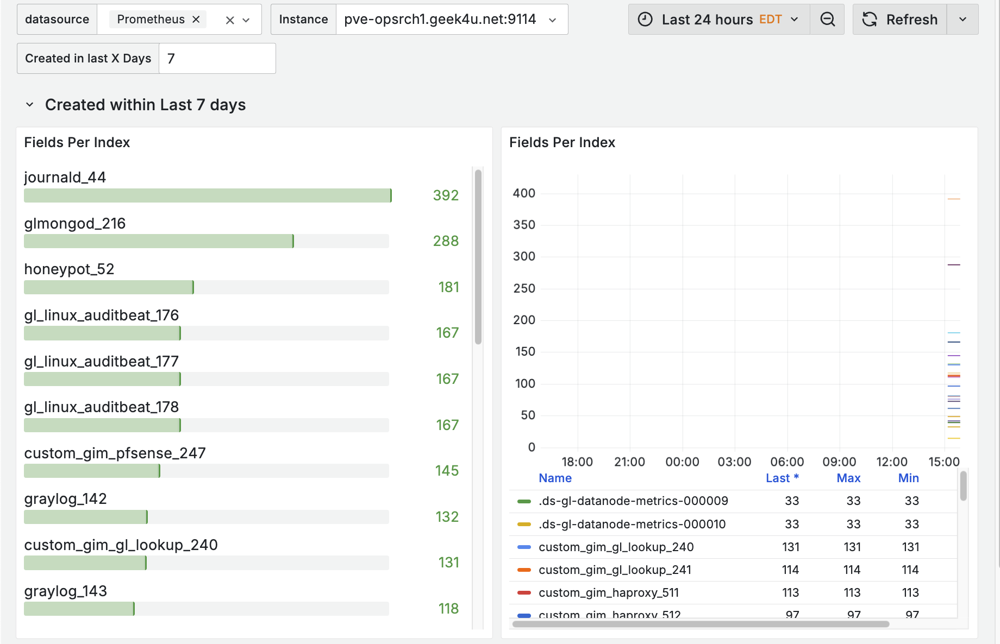

# Dashboards

## Graylog Server

Key metrics to watch for Graylog Server nodes

## Elasticsearch (OpenSearch) Fields Per Index

Requirements:
- [elasticsearch_exporter](https://github.com/prometheus-community/elasticsearch_exporter/releases/)
- The following `elasticsearch_exporter` [arguments enabled](https://github.com/drewmiranda-gl/install-scripts/tree/main/prometheus_exporters/elasticsearch_exporter#parameters):
    - `--es.indices_settings`
    - `--es.indices_mappings`

This Dashboard shows the field count for OpenSearch indices. Use the `Created in last X Days` variable to alter which indices are shown. By default, indices created within the last 7 days are shown.

A second section is also provided that shows all indices. This can help with assessing what indices, if any, are at or near their field limits (soft limit of 1,000)

