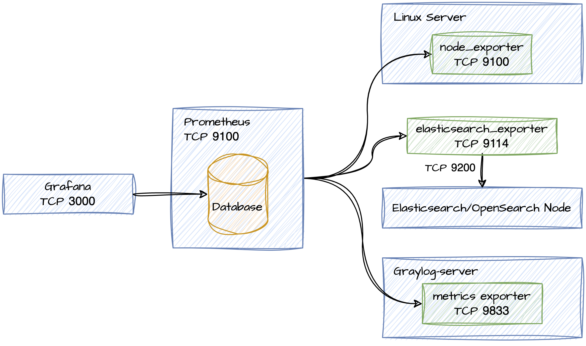

# Getting Started with Metrics and Using Prometheus and Grafana

## Introduction

This document will cover the basics of how to:

* Setup/Install/Configure:
    * Prometheus
    * Grafana
    * Exporters
        * [node_exporter](https://github.com/prometheus/node_exporter)
        * [Graylog](https://go2docs.graylog.org/current/interacting_with_your_log_data/metrics.html?Highlight=metrics#ExportviaPrometheusMetricExporting)
        * [elasticsearch_exporter](https://github.com/prometheus-community/elasticsearch_exporter)
* Setup Grafana Dashboards:
    * Node Exporter
    * Elasticsearch Exporter
    * Graylog

### How everything fits together

|  |
| --- |

## Basic Install of Prometheus and Grafana, using Docker

> [!NOTE]  
> The following assumes you already have Docker Engine installed. For documentation on installing Docker Engine, see [Install Docker Engine](https://docs.docker.com/engine/install/)

We will be using the docker compose file from [awesome-compose](https://github.com/docker/awesome-compose).

Because there is not a native way to download ONLY the `prometheus-grafana` folder, we will download the entire repo.

```sh
# Download repo
git clone https://github.com/docker/awesome-compose.git
# Execute docker compose file and start Prometheus and Grafana containers
sudo docker compose -f ./awesome-compose/prometheus-grafana/compose.yaml up -d
```

Optionally, you can copy the services and volumes from `compose.yaml` and place in your existing Docker compose file(s).

* Grafana is accessible via a web browser on port `:3000`
* Prometheus UI is accessible via a web browser on port `:9090`

## Install/Configure Exporters

Special applications, called [exporters](https://prometheus.io/docs/instrumenting/exporters/), run on your server, and serve prometheus compatible output via HTTP. Different types of exporters bind to different ports.

### Graylog

Graylog has a built in prometheus exporter, but we need to enable it:

```yml
# Add the environment and port items to your existing docker compose file
services:
  graylog:
    environment:
      GRAYLOG_PROMETHEUS_EXPORTER_ENABLED: "true"
      GRAYLOG_PROMETHEUS_EXPORTER_BIND_ADDRESS: "0.0.0.0:9833"
    ports:
    - "9833:9833/tcp" # Graylog Prometheus exporter
```

For documentation, see https://go2docs.graylog.org/current/interacting_with_your_log_data/metrics.html

### OpenSearch

> [!NOTE]  
> While this exporter is called 'elasticsearch-exporter', it is compatible with OpenSearch

Add to docker compose:

> [!NOTE]  
> Be sure to update the `--es.uri` property to use the appropriate value for your environment.

```yml
services:
  # add to services
  elasticsearch_exporter:
      image: quay.io/prometheuscommunity/elasticsearch-exporter:latest
      command:
      - '--es.uri=http://opensearch:9200'
      restart: on-failure
      ports:
      - "9114:9114/tcp"
```

This exporter binds to `:9114`

### Host metrics

Using https://hub.docker.com/r/prom/node-exporter

```yml
services:
  node_exporter:
    image: quay.io/prometheus/node-exporter:latest
    container_name: node_exporter
    command:
      - '--path.rootfs=/host'
    network_mode: host
    pid: host
    restart: unless-stopped
    volumes:
      - '/:/host:ro,rslave'
```

This exporter binds to `:9100`

## Configuring prometheus

Prometheus works by "scraping" target URLs, and saving the data in its local database. Targets are configured via `prometheus.yml` (`awesome-compose/prometheus-grafana/prometheus/prometheus.yml`)

Note that any changes made to `prometheus.yml` require restarting Prometheus, or in this case, restarting the Prometheus container: `sudo docker restart prometheus`. (Note that prometheus does support triggering a reload of the configuration file via the `/-/reload` endpoint. See https://prometheus.io/docs/prometheus/latest/configuration/configuration/ )

Unfortunately the default entry here is improperly formatted. You need to either delete this section, or indent every line by 2 spaces

```yml
# DELETE
- job_name: prometheus
  honor_timestamps: true
  scrape_interval: 15s
  scrape_timeout: 10s
  metrics_path: /metrics
  scheme: http
  static_configs:
  - targets:
    - localhost:9090

# OR INDENT WITH 2 SPACES
  - job_name: prometheus
    honor_timestamps: true
    scrape_interval: 15s
    scrape_timeout: 10s
    metrics_path: /metrics
    scheme: http
    static_configs:
    - targets:
      - localhost:9090
```

Add to the `scrape_configs` section of `prometheus.yml`. 

> [!NOTE]  
> Change target to reflect the appropriate value(s) for your environment.

```yml
# the line `scrape_configs:`
# will already be present in the default prometheus.yml file, but adding here to show context
scrape_configs:
  - job_name : graylog_exporter
    honor_timestamps : true
    scrape_interval : 15s
    scrape_timeout : 10s
    scheme : http
    static_configs :
        - targets : ['127.0.0.1:9833']

  - job_name : opensearch_exporter
    honor_timestamps : true
    scrape_interval : 15s
    scrape_timeout : 10s
    metrics_path: /metrics
    scheme : http
    static_configs :
        - targets : ['127.0.0.1:9114']

  - job_name : node_exporter
    honor_timestamps : true
    scrape_interval : 15s
    scrape_timeout : 10s
    metrics_path : /metrics
    scheme : http
    static_configs :
        - targets : ['127.0.0.1:9100']
```

Restart prometheus container to apply changes:

```sh
sudo docker restart prometheus
```

## Verify prometheus

Verify prometheus is up and healthy via `sudo docker ps`.

If the container has an error or fails to start/restart you can get some ideas about what is wrong by viewing the container logs via `sudo docker logs prometheus`

Assuming the prometheus container is running and health, verify the targets show State: UP:

1. Via a web browser, **navigate to** `:9090`
2. Click on Stats / **Targets**
3. Review the list of targets to verify that
  * you see the targets you expect to see and nothing is missing
  * the targets are State: **UP**

Additionally, you can click on the URL for each target to see the raw data that prometheus is scraping from the target.

You should see something like this:

|  |
| --- |

## Grafana

At this point you should have all of your exporters running and prometheus should be successfully scraping and storing the metrics for those exporters.

The last step is to setup some grafana dashboards to visualize the data from prometheus. In general, Grafana works in a way that is similar to Graylog, in that it queries external data sources and displays the data.

Grafana has a fantastic library of dashboards via https://grafana.com/grafana/dashboards/ .

For our purposes we will import some dashboards:

1. Via a web browser, **navigate to** `:3000`
2. **Login** with the default user/pass
  * this is configurable via the docker compose using `GF_SECURITY_ADMIN_USER` and `GF_SECURITY_ADMIN_PASSWORD` environment variables.
  * username: admin
  * password: grafana
3. Using the menu on the left side of the page, navigate to **Dashboards**
4. Click **New** / **Import**<br>
5. **Paste** the ID, click **Load**, select a datasource, then finally click **Import**<br>
  * **Repeat** import for each
    * 1860
      * [Node Exporter Full](https://grafana.com/grafana/dashboards/1860-node-exporter-full/)
    * 14191
      * [Elasticsearch Exporter Quickstart and Dashboard](https://grafana.com/grafana/dashboards/14191-elasticsearch-overview/)

For the Graylog dashboard, we will use the one from this repo: `grafana/dashboards/Graylog Server-1724432393088.json`. The import process will use the same steps as above, but instead of inputting a Dashboard ID, upload the `.json` file:

|  |
| --- |

**Once completed**, you should have 3 dashboards:

* Elasticsearch Exporter Quickstart and Dashboard
* Graylog Server
* Node Exporter Full

|  |
| --- |

> [!NOTE]  
> You can also copy/paste the JSON instead of downloading/uploading the `.json` file.

### Basic Concepts

Grafana dashboards are made up primally of 2 elements:

* **Visualizations** - These are the widgets that will show data and these are the heart of all Grafana dashboards
* **Row** - Visualizations can be grouped into rows for organization. Rows can easily be moved up or down in the order and they can be collapsed. This is useful if you have Visualizations you do not frequently use, but still want to keep them on the dashboard.

When using a Grafana dashboard, you must specify a **Time Range** for retrieved data. Typically this will be a relative range, such as "Last 24 hours" but you can also use Absolute time ranges.

|  |
| --- |

Many dashboards will also have one or more **variables** that control what data is displayed. For example, you may have a single "Node Exporter Full" dashboard, but multiple devices beings scraped by prometheus. You can use the "Host" variable to change what single device you are viewing metrics for.

|  |
| --- |

## Useful Metrics Reference

At this point you may have observed that there are A LOT of metrics to look through. Many won't be useful day to day and may be more useful only if you need them to troubleshoot something specific.

Here is a summary of useful metrics and what they are used for:

### node_exporter

These are metrics generated by `node_exporter` and are viewed using the [Node Exporter Full](https://grafana.com/grafana/dashboards/1860-node-exporter-full/) dashboard.

Description | Section/Row | Visualization Name | Metric(s)
---- | ---- | ---- | ----
**Realtime Resource Pressure**<br>(using Pressure Stall Information)<br>Useful to see if there are resource contention issues, such as insufficient CPU or slow storage. Storage pressure is typically the most common. | Quick CPU / Mem / Disk | Pressure | `node_pressure_cpu_waiting_seconds_total`<br>`node_pressure_memory_waiting_seconds_total`<br>`node_pressure_io_waiting_seconds_total`
**Pressure Stall Information**<br>Similar to the above visualization, but shows metrics plotted over time, rather than showing the most recent value. | System Misc | Pressure Stall Information | `node_pressure_cpu_waiting_seconds_total`<br>`node_pressure_memory_waiting_seconds_total`<br>`node_pressure_memory_stalled_seconds_total`<br>`node_pressure_io_waiting_seconds_total`<br>`node_pressure_io_stalled_seconds_total`
**CPU Usage**<br>How much CPU is being used and whether usage is consumed by System, User, or IO Wait | Basic CPU / Mem / Net / Disk | CPU Basic | `node_cpu_seconds_total`
**Memory Usage**<br>Type of memory usage.<br>RAM Used and RAM Cache are typically the most useful. | Basic CPU / Mem / Net / Disk | Memory Basic | `node_memory_MemTotal_bytes`<br>`node_memory_MemFree_bytes`<br>`node_memory_Cached_bytes`<br>`node_memory_Buffers_bytes`<br>`node_memory_SReclaimable_bytes`<br>`node_memory_SwapTotal_bytes`<br>`node_memory_SwapFree_bytes`
**Disk I/O Utilization %**<br>Percent of time disk is utilized in a given time period. This metric combines reads and writes so it is not possible to use it to determine if usage is consumed by reads or writes. The 'Disk IOps' visualization, however, does show different metrics for read/write. | CPU / Memory / Net / Disk | I/O Utilization | `node_disk_io_time_seconds_total`

Have favorite or useful metrics not listed? Let me know!

### elasticsearch_exporter

There are metrics generated by `elasticsearch_exporter` and are viewed using the [Elasticsearch Exporter Quickstart and Dashboard](https://grafana.com/grafana/dashboards/14191-elasticsearch-overview/) dashboard.

Description | Section/Row | Visualization Name | Metric(s)
---- | ---- | ---- | ----
**JVM memory usage %**<br>JVM memory used by OpenSearch | KPI | JVM memory used Avg. | `elasticsearch_jvm_memory_used_bytes`<br>`elasticsearch_jvm_memory_max_bytes`
**Pending tasks**<br>Pending OpenSearch tasks. Cluster level changes which have not yet been executed. | KPI | Pending tasks | `elasticsearch_cluster_health_number_of_pending_tasks`
**Shard Statuses**<br>Status of all shards in OpenSearch cluster. Helpful to see if there are Initializing, Relocating, Delayed, or Unassigned shards. | Shards | * | `elasticsearch_cluster_health_active_primary_shards`<br>`elasticsearch_cluster_health_active_shards`<br>`elasticsearch_cluster_health_initializing_shards`<br>`elasticsearch_cluster_health_relocating_shards`<br>`elasticsearch_cluster_health_delayed_unassigned_shards`<br>`elasticsearch_cluster_health_unassigned_shards`
**Search Query Time**<br>Time taken to execute search queries. | Times | Query time | `elasticsearch_indices_search_query_time_seconds`
**Indexing Time**<br>Time taken to index (store) messages. | Times | Indexing time | `elasticsearch_indices_indexing_index_time_seconds_total`
**Merging Time**<br>Time taken to merge segments. Typically this only occurs when [Graylog rotates an index set](https://go2docs.graylog.org/current/setting_up_graylog/index_model.html#IndexRotationConfiguration). | Times | Indexing time | `elasticsearch_indices_merges_total_time_seconds_total`
**Rejected Threads**<br>Count of rejected threads. See threads section below for more details. Rejected threads can indicate performance issues where OpenSearch is overloaded and able to appropriately handle requests for reading or writing data. | Thread Pool | `elasticsearch_thread_pool_rejected_count`


For a complete list of metrics with descriptions, see https://github.com/prometheus-community/elasticsearch_exporter

#### Threads

> [OpenSearch] node[s] uses several thread pools to manage memory consumption. Queues associated with many of the thread pools enable pending requests to be held instead of discarded.

The following is not an exhaustive list. See [Thread pools](https://www.elastic.co/guide/en/elasticsearch/reference/current/modules-threadpool.html)

Thread | Description
---- | ----
**search** | For coordination of count/search operations at the shard level whose computation is offloaded to the search_worker thread pool. Used also by fetch and other search related operations Thread pool type is fixed with a size of `int((# of allocated processors * 3) / 2) + 1`, and queue_size of 1000.
search_worker | For the heavy workload of count/search operations that may be executed concurrently across segments within the same shard when possible.
**write** | Responsible for indexing/saving messages. Thread pool type is fixed with a size of `# of allocated processors`.
**refresh** | For refresh operations. Thread pool type is scaling with a keep-alive of `5m` and a max of `min(10, (# of allocated processors) / 2)`.
**flush** | For flush and translog fsync operations. Thread pool type is scaling with a keep-alive of `5m` and a default maximum size of `min(5, (# of allocated processors) / 2)`.
**force_merge** | For force merge operations. This occurs anytime [Graylog rotates an index set](https://go2docs.graylog.org/current/setting_up_graylog/index_model.html#IndexRotationConfiguration). Thread pool type is fixed with a size of `max(1, (# of allocated processors) / 8) and an unbounded queue size`.

### Graylog

There are metrics generated by the metric exporter built into `graylog-server`. These are metrics specific to Graylog.

Description | Section/Row | Visualization Name | Metric(s)
---- | ---- | ---- | ----
**Process Buffer Process Time**<br>Time taken for process buffer to process log messages. Typically this involves things like extractors, stream rules, and pipelines. Typically most CPU intensive part of Graylog. | Buffers | Process Buffer Process Time | `gl_buffer_process_time{type="process"}`
**Output Buffer Process Time**<br>Time taken for output buffer to process messages. | Buffers | Output Buffer Process Time | `gl_buffer_process_time{type="output"}`
**BlockingBatchedESOutput.processTime**<br>Amount of time Graylog is waiting for OpenSearch to save messages from batch. This is can greatly influence how long messages take to become searchable after being received by Graylog. If Graylog is writing messages to OpenSearch faster than it can save them, the Graylog Output buffer will start to fill. | Messages | BlockingBatchedESOutput.processTime | `gl_blocking_elasticsearch_output_process_time`
**Output Messages Failure Count**<br>Number of Graylog messages that failed to write to OpenSearch. Typically this is caused by indexing errors and Graylog will show system alerts. See [Index and Processing Failures](https://go2docs.graylog.org/current/getting_in_log_data/indexer_and_processing_failures.html) | Messages | Output Msgs Failures | `gl_elasticsearch_output_failures_total`
**Messages in Graylog Journal**<br>The Graylog stores messages in a on-disk journal before they read into the process buffer to be processed. If the processing is too slow, meaning messages are being received faster than Graylog can process them, once the process buffer is full, messages will start to build up in the Journal. This is not a problem by itself but it can cause delays with log messages not being immediately searchable. | Journal | Journal Uncommitted Entries | `gl_journal_entries_uncommitted`