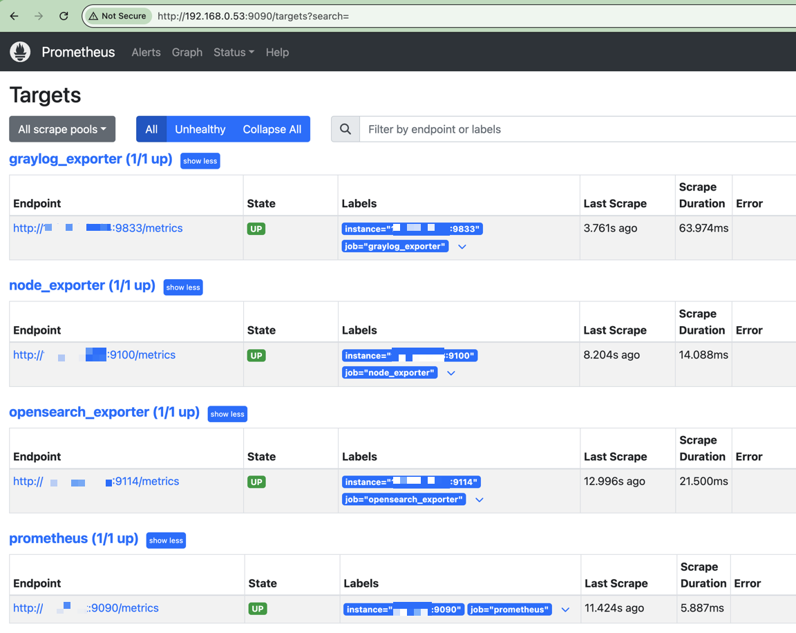
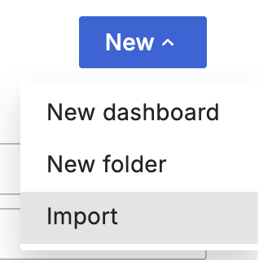
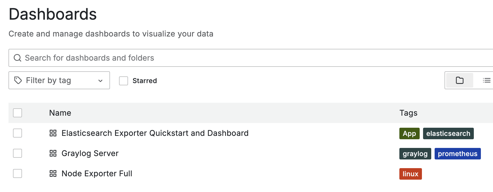

# Getting Started with Metrics and Using Prometheus and Grafana

## Introduction

This document will cover the basics of how to:

* Setup/Install/Configure:
    * Prometheus
    * Grafana
    * Exporters
        * [node_exporter](https://github.com/prometheus/node_exporter)
        * [Graylog](https://go2docs.graylog.org/current/interacting_with_your_log_data/metrics.html?Highlight=metrics#ExportviaPrometheusMetricExporting)
        * [elasticsearch_exporter](https://github.com/prometheus-community/elasticsearch_exporter)
* Setup Grafana Dashboards:
    * Node Exporter
    * Elasticsearch Exporter
    * Graylog

## Basic Install of Prometheus and Grafana, using Docker

> [!NOTE]  
> The following assumes you already have Docker Engine installed. For documentation on installing Docker Engine, see [Install Docker Engine](https://docs.docker.com/engine/install/)

We will be using the docker compose file from [awesome-compose](https://github.com/docker/awesome-compose).

Because there is not a native way to download ONLY the `prometheus-grafana` folder, we will download the entire repo.

```sh
# Download repo
git clone https://github.com/docker/awesome-compose.git
# Execute docker compose file and start Prometheus and Grafana containers
sudo docker compose -f ./awesome-compose/prometheus-grafana/compose.yaml up -d
```

Optionally, you can copy the services and volumes from `compose.yaml` and place in your existing Docker compose file(s).

* Grafana is accessible via a web browser on port `:3000`
* Prometheus UI is accessible via a web browser on port `:9090`

## Install/Configure Exporters

Special applications, called [exporters](https://prometheus.io/docs/instrumenting/exporters/), run on your server, and serve prometheus compatible output via HTTP. Different types of exporters bind to different ports.

### Graylog

Graylog has a built in prometheus exporter, but we need to enable it:

```yml
# Add the environment and port items to your existing docker compose file
services:
  graylog:
    environment:
      GRAYLOG_PROMETHEUS_EXPORTER_ENABLED: "true"
      GRAYLOG_PROMETHEUS_EXPORTER_BIND_ADDRESS: "0.0.0.0:9833"
    ports:
    - "9833:9833/tcp" # Graylog Prometheus exporter
```

For documentation, see https://go2docs.graylog.org/current/interacting_with_your_log_data/metrics.html

### OpenSearch

Add to docker compose:

> [!NOTE]  
> Be sure to update the `--es.uri` property to use the appropriate value for your environment.

```yml
services:
  # add to services
  elasticsearch_exporter:
      image: quay.io/prometheuscommunity/elasticsearch-exporter:latest
      command:
      - '--es.uri=http://opensearch:9200'
      restart: on-failure
      ports:
      - "9114:9114/tcp"
```

This exporter binds to `:9114`

### Host metrics

Using https://hub.docker.com/r/prom/node-exporter

```yml
services:
  node_exporter:
    image: quay.io/prometheus/node-exporter:latest
    container_name: node_exporter
    command:
      - '--path.rootfs=/host'
    network_mode: host
    pid: host
    restart: unless-stopped
    volumes:
      - '/:/host:ro,rslave'
```

This exporter binds to `:9100`

## Configuring prometheus

Prometheus works by "scraping" target URLs, and saving the data in its local database. Targets are configured via `prometheus.yml` (`awesome-compose/prometheus-grafana/prometheus/prometheus.yml`)

Note that any changes made to `prometheus.yml` require restarting Prometheus, or in this case, restarting the Prometheus container: `sudo docker restart prometheus`. (Note that prometheus does support triggering a reload of the configuration file via the `/-/reload` endpoint. See https://prometheus.io/docs/prometheus/latest/configuration/configuration/ )

Unfortunately the default entry here is improperly formatted. You need to either delete this section, or indent every line by 2 spaces

```yml
# DELETE
- job_name: prometheus
  honor_timestamps: true
  scrape_interval: 15s
  scrape_timeout: 10s
  metrics_path: /metrics
  scheme: http
  static_configs:
  - targets:
    - localhost:9090

# OR INDENT WITH 2 SPACES
  - job_name: prometheus
    honor_timestamps: true
    scrape_interval: 15s
    scrape_timeout: 10s
    metrics_path: /metrics
    scheme: http
    static_configs:
    - targets:
      - localhost:9090
```

Add to the `scrape_configs` section of `prometheus.yml`. 

> [!NOTE]  
> Change target to reflect the appropriate value(s) for your environment.

```yml
# the line `scrape_configs:`
# will already be present in the default prometheus.yml file, but adding here to show context
scrape_configs:
  - job_name : graylog_exporter
    honor_timestamps : true
    scrape_interval : 15s
    scrape_timeout : 10s
    scheme : http
    static_configs :
        - targets : ['127.0.0.1:9833']

  - job_name : opensearch_exporter
    honor_timestamps : true
    scrape_interval : 15s
    scrape_timeout : 10s
    metrics_path: /metrics
    scheme : http
    static_configs :
        - targets : ['127.0.0.1:9114']

  - job_name : node_exporter
    honor_timestamps : true
    scrape_interval : 15s
    scrape_timeout : 10s
    metrics_path : /metrics
    scheme : http
    static_configs :
        - targets : ['127.0.0.1:9100']
```

Restart prometheus container to apply changes:

```sh
sudo docker restart prometheus
```

## Verify prometheus

Verify prometheus is up and healthy via `sudo docker ps`.

If the container has an error or fails to start/restart you can get some ideas about what is wrong by viewing the container logs via `sudo docker logs prometheus`

Assuming the prometheus container is running and health, verify the targets show State: UP:

1. Via a web browser, **navigate to** `:9090`
2. Click on Stats / **Targets**
3. Review the list of targets to verify that
  * you see the targets you expect to see and nothing is missing
  * the targets are State: **UP**

Additionally, you can click on the URL for each target to see the raw data that prometheus is scraping from the target.

You should see something like this:

|  |
| --- |

## Grafana

At this point you should have all of your exporters running and prometheus should be successfully scraping and storing the metrics for those exporters.

The last step is to setup some grafana dashboards to visualize the data from prometheus. In general, Grafana works in a way that is similar to Graylog, in that it queries external data sources and displays the data.

Grafana has a fantastic library of dashboards via https://grafana.com/grafana/dashboards/ .

For our purposes we will import some dashboards:

1. Via a web browser, **navigate to** `:3000`
2. **Login** with the default user/pass
  * this is configurable via the docker compose using `GF_SECURITY_ADMIN_USER` and `GF_SECURITY_ADMIN_PASSWORD` environment variables.
  * username: admin
  * password: grafana
3. Using the menu on the left side of the page, navigate to **Dashboards**
4. Click **New** / **Import**<br>
5. **Paste** the ID, click **Load**, select a datasource, then finally click **Import**<br>
  * **Repeat** import for each
    * 1860
      * [Node Exporter Full](https://grafana.com/grafana/dashboards/1860-node-exporter-full/)
    * 14191
      * [Elasticsearch Exporter Quickstart and Dashboard](https://grafana.com/grafana/dashboards/14191-elasticsearch-overview/)

For the Graylog dashboard, we will use the one from this repo: `grafana/dashboards/Graylog Server-1724432393088.json`. The import process will use the same steps as above, but instead of inputting a Dashboard ID, upload the `.json` file:

|  |
| --- |

**Once completed**, you should have 3 dashboards:

* Elasticsearch Exporter Quickstart and Dashboard
* Graylog Server
* Node Exporter Full

|  |
| --- |

### Basic Concepts

Grafana dashboards are made up primally of 2 elements:

* **Visualizations** - These are the widgets that will show data and these are the heart of all Grafana dashboards
* **Row** - Visualizations can be grouped into rows for organization. Rows can easily be moved up or down in the order and they can be collapsed. This is useful if you have Visualizations you do not frequently use, but still want to keep them on the dashboard.

When using a Grafana dashboard, you must specify a **Time Range** for retrieved data. Typically this will be a relative range, such as "Last 24 hours" but you can also use Absolute time ranges.

|  |
| --- |

Many dashboards will also have one or more **variables** that control what data is displayed. For example, you may have a single "Node Exporter Full" dashboard, but multiple devices beings scraped by prometheus. You can use the "Host" variable to change what single device you are viewing metrics for.

|  |
| --- |

